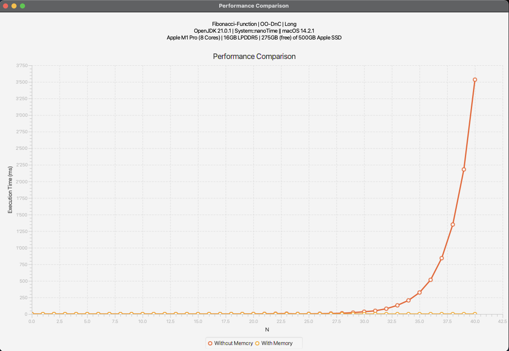
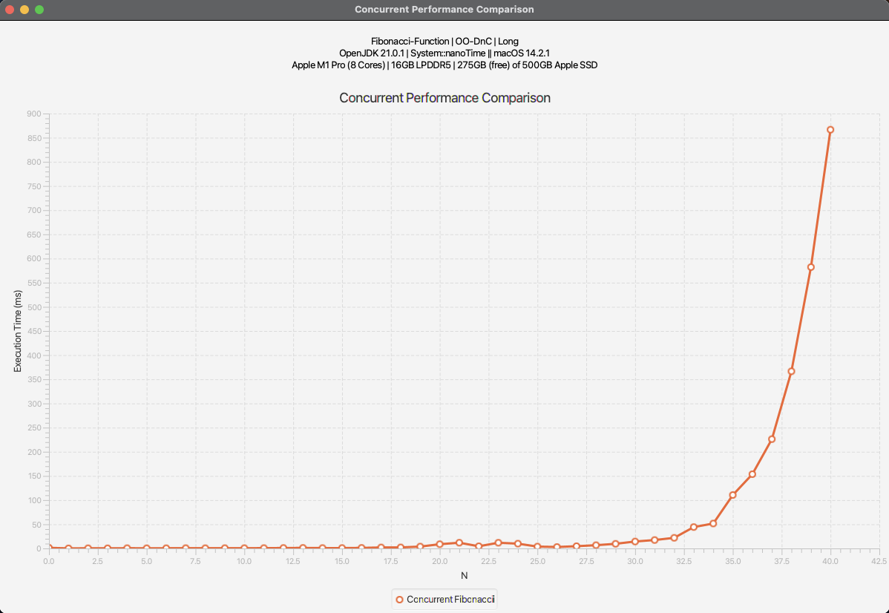

# Setup
Calculating the first 40 Fibonacci Numbers with all implementations. The test is run on a MacBook Pro
Apple M1 Pro (more specs on images below).

# Algorithm
The algorithm is a basic Fibonacci algorithm with divide and conquer pattern. There are the following steps the implementation does:
* Checks if current `n` is base case or not
* Decomposes the problem into subcomponents - takes the previous two numbers (`n-1`, `n-2`)
* For each subcomponent it recursively calls the `divideAndConquer()` method
* Recombines the intermediate results and returns

## Characteristics
* This implementation works with `Long` (8 Bytes) as data structure
* Is not in-place since it works with `Long` Object

# Single Threaded
## With/Without Memory
For this task there are two different implementations. One in which every Fibonacci number
has to be calculated, even if previously calculated.
And there is another implementation where the results of the nth numbers is stored. So with a new calculation it checks
if this numbers has already been calculated.
## Implementation
Default implementation without memory:
```java
default T divideAndConquer() {
    if (this.isBasic()) return  this.baseFun();

    List<? extends DivideAndConquerable<T>> subcomponents = this.decompose();

    List<T> intermediateResults = new ArrayList<T>(subcomponents.size());

    subcomponents.forEach(
            subcomponent -> intermediateResults.add(
                    subcomponent.divideAndConquer()
            )
    );

    return recombine(intermediateResults);
}
```

Implementation with memory:
```java
@Override
public Long divideAndConquerWithMemory(Object... memory) {
    if (checkPreconditions(memory)) return (Long) memory[n];

    List<? extends DivideAndConquerable<Long>> subcomponents = this.decompose();
    List<Long> intermediateResults = new ArrayList<>(subcomponents.size());

    subcomponents.forEach(
        subcomponent -> intermediateResults.add(
            ((DynamicProgrammingDivideAndConquerable<Long>) subcomponent).divideAndConquerWithMemory(memory)
        )
    );

    memory[n] = recombine(intermediateResults);
    return (Long) memory[n];
}

private boolean checkPreconditions(Object[] memory) {
    if (memory[n] != null)
        return true;

    if (this.isBasic()) {
        memory[n] = this.baseFun();
        return true;
    }
    return false;
}
```

## Comparison
As one can observer in the image below, the memory implementation doesn't grow exponentially.
The memory implementation is still very fast even for some higher numbers. 
The default implementation without memory saving grows exponentially as the numbers grows.



# Multi Threaded
For the concurrent task I used the ForkJoin Class to handle the multi threading. 
Similar to the single threaded version, the algorithm is the same, but the computation of the 
subproblems/subcomponents is done in different threads.
## Implementation
Default implementation with ForkJoin. The `invoke()` method calls `compute()`:
```java
@Override
public Long concurrentDivideAndConquer() throws ExecutionException, InterruptedException {
    final ForkJoinPool forkJoinPool = new ForkJoinPool();
    return forkJoinPool.invoke(this);
}

@Override
protected Long compute() {
    if (this.isBasic()) {
        return this.baseFun();
    }

    List<ConcurrentFibonacci> subtasks = new ArrayList<>();
    subtasks.add(new ConcurrentFibonacci(n - 1));
    subtasks.add(new ConcurrentFibonacci(n - 2));

    invokeAll(subtasks);

    long result = 0;
    for (ConcurrentFibonacci subtask : subtasks) {
        result += subtask.join();
    }

    return result;
}
```

## Comparison
Similar to the single threaded approach without memory saving the time taken for one computation
grows exponentially. Though this implementation doesn't grow as fast as the single threaded one
without memory.


# Summary
From this short test runs and small numbers I can say that the memory approach is the fastet one.
And also it doesn't grow exponentially which makes even the multi threaded approach not that sexy.

But for a more scientific approach I should do more tests with larger numbers (e.g. Fibonacci(1000)). Maybe also combine
the multi threaded implementation with the memory one for better results.